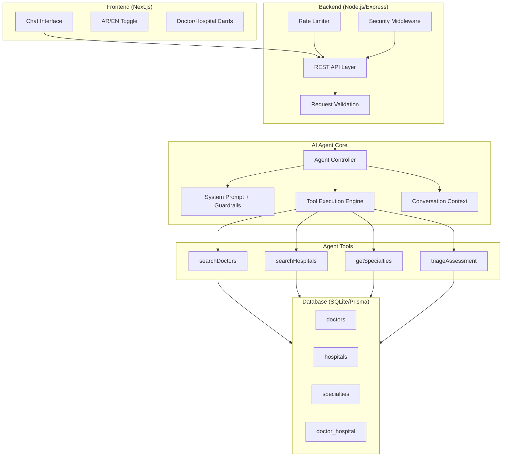
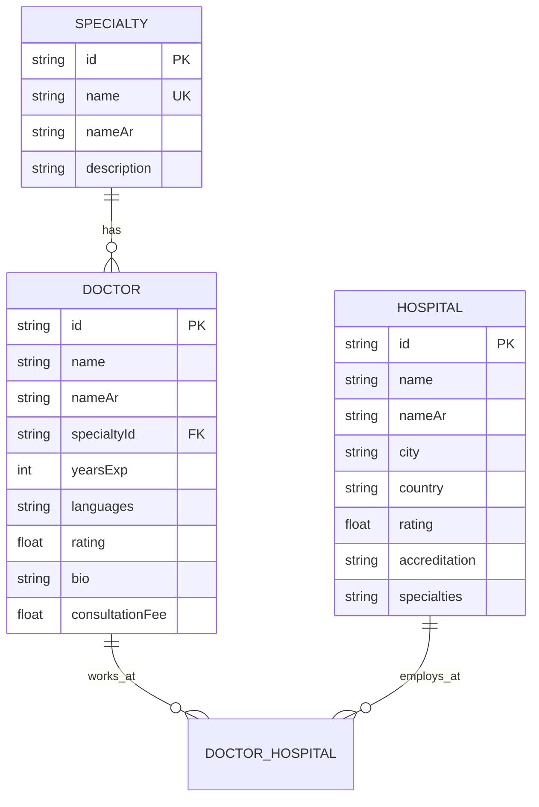
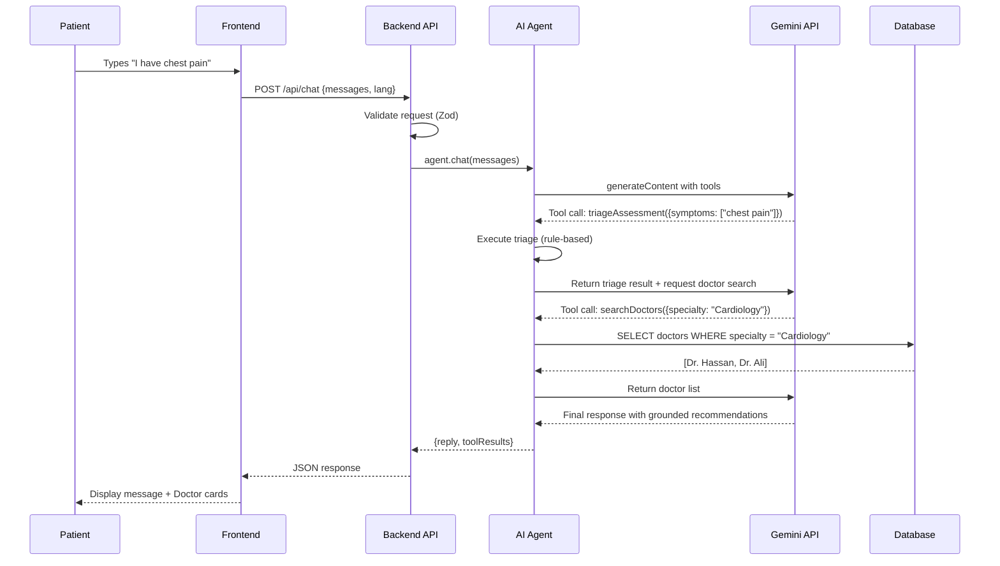

# HealTrip AI Patient Decision Assistant — Implementation Plan

## Overview

Build a prototype that demonstrates a **medical AI assistant** where patients describe symptoms and receive:

- Clarifying questions to understand their condition
- Triage-level assessment (urgency classification)
- Doctor/hospital recommendations **grounded in real database data only**
- Clear next-step guidance

> [!IMPORTANT]
> This is a **prototype** — the AI does NOT provide medical diagnoses. It triages, asks clarifying questions, and recommends providers from the database. All responses include a medical disclaimer.

---

## Architecture Overview



---

## Project Structure

```
healtrip-ai-assistant/
├── backend/
│   ├── prisma/
│   │   ├── schema.prisma          # Database schema
│   │   └── seed.ts                # Mock data seeding
│   ├── src/
│   │   ├── index.ts               # Express app entry point
│   │   ├── config/
│   │   │   └── env.ts             # Environment configuration
│   │   ├── middleware/
│   │   │   ├── errorHandler.ts    # Global error handler
│   │   │   ├── rateLimiter.ts     # Rate limiting
│   │   │   ├── security.ts        # Security headers (helmet)
│   │   │   └── validation.ts      # Request validation (zod)
│   │   ├── routes/
│   │   │   ├── chat.ts            # POST /api/chat
│   │   │   ├── doctors.ts         # GET /api/doctors
│   │   │   └── hospitals.ts       # GET /api/hospitals
│   │   ├── agent/
│   │   │   ├── agent.ts           # Main AI agent controller
│   │   │   ├── systemPrompt.ts    # System prompt definition
│   │   │   ├── tools.ts           # Tool definitions for Gemini
│   │   │   └── toolExecutor.ts    # Tool execution logic
│   │   ├── services/
│   │   │   ├── doctorService.ts   # Doctor queries
│   │   │   └── hospitalService.ts # Hospital queries
│   │   └── types/
│   │       └── index.ts           # TypeScript interfaces
│   ├── package.json
│   └── tsconfig.json
├── frontend/
│   ├── src/
│   │   ├── app/
│   │   │   ├── layout.tsx         # Root layout with font + dir
│   │   │   ├── page.tsx           # Main chat page
│   │   │   └── globals.css        # Global styles
│   │   ├── components/
│   │   │   ├── ChatContainer.tsx  # Main chat wrapper
│   │   │   ├── MessageBubble.tsx  # Individual message
│   │   │   ├── ChatInput.tsx      # Message input area
│   │   │   ├── DoctorCard.tsx     # Doctor recommendation card
│   │   │   ├── HospitalCard.tsx   # Hospital recommendation card
│   │   │   ├── LanguageToggle.tsx # AR/EN switcher
│   │   │   ├── TypingIndicator.tsx# Typing animation
│   │   │   └── Disclaimer.tsx     # Medical disclaimer banner
│   │   ├── hooks/
│   │   │   ├── useChat.ts         # Chat state management
│   │   │   └── useLanguage.ts     # Language context
│   │   ├── lib/
│   │   │   ├── api.ts             # API client
│   │   │   └── types.ts           # Shared types
│   │   └── i18n/
│   │       ├── ar.json            # Arabic translations
│   │       └── en.json            # English translations
│   ├── package.json
│   └── tsconfig.json
├── .env.example                   # Environment template
├── .gitignore
└── README.md                      # Architecture & setup docs
```

---

## Phase 1: Project Setup & Infrastructure

### Step 1.1 — Initialize Backend

```bash
mkdir -p backend && cd backend
npm init -y
npm install express cors helmet express-rate-limit zod @google/generative-ai @prisma/client dotenv
npm install -D typescript ts-node @types/express @types/cors @types/node prisma nodemon tsx
npx tsc --init
```

#### [NEW] [tsconfig.json](file:///home/amrshomis/Amr/healtrip-ai-assistant/backend/tsconfig.json)

```json
{
  "compilerOptions": {
    "target": "ES2020",
    "module": "commonjs",
    "lib": ["ES2020"],
    "outDir": "./dist",
    "rootDir": "./src",
    "strict": true,
    "esModuleInterop": true,
    "skipLibCheck": true,
    "forceConsistentCasingInFileNames": true,
    "resolveJsonModule": true,
    "declaration": true,
    "declarationMap": true,
    "sourceMap": true
  },
  "include": ["src/**/*"],
  "exclude": ["node_modules", "dist"]
}
```

#### [NEW] [package.json](file:///home/amrshomis/Amr/healtrip-ai-assistant/backend/package.json) scripts

```json
{
  "scripts": {
    "dev": "tsx watch src/index.ts",
    "build": "tsc",
    "start": "node dist/index.js",
    "db:generate": "npx prisma generate",
    "db:push": "npx prisma db push",
    "db:seed": "tsx prisma/seed.ts"
  }
}
```

### Step 1.2 — Initialize Frontend

```bash
npx -y create-next-app@latest frontend --typescript --tailwind --eslint --app --src-dir --no-import-alias
```

> [!NOTE]
> Using Tailwind here because Next.js `create-next-app` bundles it natively and it simplifies RTL support.

### Step 1.3 — Environment Configuration

#### [NEW] [.env.example](file:///home/amrshomis/Amr/healtrip-ai-assistant/.env.example)

```env
# Backend
PORT=3001
GEMINI_API_KEY=your-gemini-api-key-here
DATABASE_URL="file:./dev.db"
FRONTEND_URL=http://localhost:3000
NODE_ENV=development

# Frontend
NEXT_PUBLIC_API_URL=http://localhost:3001
```

---

## Phase 2: Database & Data Layer

### Step 2.1 — Database Schema

#### [NEW] [schema.prisma](file:///home/amrshomis/Amr/healtrip-ai-assistant/backend/prisma/schema.prisma)

```prisma
datasource db {
  provider = "sqlite"
  url      = env("DATABASE_URL")
}

generator client {
  provider = "prisma-client-js"
}

model Specialty {
  id          String   @id @default(uuid())
  name        String   @unique        // "Cardiology"
  nameAr      String                  // "أمراض القلب"
  description String?
  doctors     Doctor[]
}

model Doctor {
  id            String   @id @default(uuid())
  name          String                  // "Dr. Ahmed Hassan"
  nameAr        String                  // "د. أحمد حسن"
  specialty     Specialty @relation(fields: [specialtyId], references: [id])
  specialtyId   String
  yearsExp      Int
  languages     String                  // JSON array: ["English","Arabic"]
  rating        Float    @default(0)
  bio           String?
  bioAr         String?
  consultationFee Float?
  availability  String?                 // JSON: available days/hours
  hospitals     DoctorHospital[]
  createdAt     DateTime @default(now())
}

model Hospital {
  id          String   @id @default(uuid())
  name        String                  // "Istanbul Medical Center"
  nameAr      String                  // "مركز إسطنبول الطبي"
  city        String                  // "Istanbul"
  cityAr      String                  // "إسطنبول"
  country     String                  // "Turkey"
  countryAr   String                  // "تركيا"
  address     String?
  rating      Float    @default(0)
  accreditation String?               // "JCI Accredited"
  specialties String                  // JSON array of specialty names
  doctors     DoctorHospital[]
  createdAt   DateTime @default(now())
}

model DoctorHospital {
  id         String   @id @default(uuid())
  doctor     Doctor   @relation(fields: [doctorId], references: [id])
  doctorId   String
  hospital   Hospital @relation(fields: [hospitalId], references: [id])
  hospitalId String

  @@unique([doctorId, hospitalId])
}
```

**Entity Relationship:**



### Step 2.2 — Seed Data

#### [NEW] [seed.ts](file:///home/amrshomis/Amr/healtrip-ai-assistant/backend/prisma/seed.ts)

Seed the database with:

- **6 Specialties**: Cardiology, Orthopedics, Neurology, Oncology, Gastroenterology, General Surgery
- **12 Doctors**: 2 per specialty, with realistic Arabic/English names, bios, ratings
- **4 Hospitals**: In Istanbul, Ankara, Dubai, Amman — with JCI accreditation details
- **Doctor-Hospital assignments**: Each doctor linked to 1–2 hospitals

All data will be bilingual (Arabic + English) with realistic consultation fees, years of experience, and availability schedules.

---

## Phase 3: AI Agent Core (Most Critical Phase)

### Step 3.1 — System Prompt Design

#### [NEW] [systemPrompt.ts](file:///home/amrshomis/Amr/healtrip-ai-assistant/backend/src/agent/systemPrompt.ts)

The system prompt is the **core of the agent's behavior**. Key principles:

```
ROLE:
You are HealTrip AI Assistant — a medical triage and patient navigation assistant.
You help patients understand their symptoms, assess urgency, and find appropriate
doctors and hospitals from the HealTrip network.

CRITICAL RULES:
1. You are NOT a doctor. You do NOT diagnose conditions.
2. NEVER fabricate doctor names, hospital names, or medical data.
3. ONLY recommend doctors/hospitals returned by your tools.
4. If no matching providers exist in the database, say so honestly.
5. Always ask clarifying questions before recommending providers.
6. For emergency symptoms (chest pain, stroke signs, severe bleeding),
   IMMEDIATELY advise calling emergency services FIRST.
7. Every response must include: "This is not medical advice.
   Please consult a healthcare professional."
8. Respond in the same language the patient uses (Arabic or English).

WORKFLOW:
Step 1: Understand the patient's symptoms (ask 2-3 clarifying questions)
Step 2: Assess urgency level (Emergency / Urgent / Routine)
Step 3: Use tools to search for appropriate specialists
Step 4: Present options with doctor details from the database
Step 5: Suggest next steps (book appointment, visit ER, etc.)

TOOL USAGE:
- Use searchDoctors when you know what specialty the patient needs
- Use searchHospitals to find facilities in a specific location
- Use triageAssessment to classify urgency based on collected symptoms
- ALWAYS use tools before recommending. NEVER guess.
```

### Step 3.2 — Tool Definitions

#### [NEW] [tools.ts](file:///home/amrshomis/Amr/healtrip-ai-assistant/backend/src/agent/tools.ts)

Define Gemini function-calling tools:

| Tool               | Parameters                                          | Returns                                     | Purpose                              |
| ------------------ | --------------------------------------------------- | ------------------------------------------- | ------------------------------------ |
| `searchDoctors`    | `specialty`, `language?`, `minRating?`, `city?`     | Doctor[] with hospital info                 | Find doctors by specialty/filters    |
| `searchHospitals`  | `city?`, `country?`, `specialty?`, `accreditation?` | Hospital[]                                  | Find hospitals by location/specialty |
| `triageAssessment` | `symptoms[]`, `duration`, `severity (1-10)`, `age?` | `{urgency, recommendedSpecialty, shouldER}` | Classify urgency level               |
| `getSpecialtyInfo` | `specialtyName`                                     | Specialty details + doctor count            | Get info about a medical specialty   |

### Step 3.3 — Tool Executor

#### [NEW] [toolExecutor.ts](file:///home/amrshomis/Amr/healtrip-ai-assistant/backend/src/agent/toolExecutor.ts)

```typescript
// Pseudocode for tool execution flow:
async function executeTool(toolName: string, args: Record<string, any>) {
  switch (toolName) {
    case "searchDoctors":
      // Query Prisma for doctors matching filters
      // Return ONLY database results, no fabrication
      return await doctorService.search(args);

    case "searchHospitals":
      return await hospitalService.search(args);

    case "triageAssessment":
      // Rule-based triage (NOT AI-generated)
      // Maps symptoms to urgency levels using predefined rules
      return triageEngine.assess(args);

    case "getSpecialtyInfo":
      return await prisma.specialty.findFirst({
        where: { name: { contains: args.specialtyName } },
        include: { _count: { select: { doctors: true } } },
      });
  }
}
```

### Step 3.4 — Agent Controller

#### [NEW] [agent.ts](file:///home/amrshomis/Amr/healtrip-ai-assistant/backend/src/agent/agent.ts)

The agent controller orchestrates the Gemini API call with tool-calling:

```typescript
// Simplified flow:
async function chat(messages: Message[], conversationId: string) {
  // 1. Configure model with system instruction
  const fullMessages = [
    { role: "system", content: SYSTEM_PROMPT },
    ...messages,
  ];

  // 2. Call Gemini with tools
  const model = genAI.getGenerativeModel({
    model: "gemini-3.8-flash",
    systemInstruction: SYSTEM_PROMPT,
    tools: [{ functionDeclarations: TOOL_DECLARATIONS }],
    generationConfig: { temperature: 0.3, maxOutputTokens: 1500 },
  });
  const result = await model.generateContent({ contents });

  // 3. If model wants to call tools, execute them
  const choice = response.choices[0];
  if (choice.finish_reason === "tool_calls") {
    const toolResults = await Promise.all(
      choice.message.tool_calls.map((tc) =>
        executeTool(tc.function.name, JSON.parse(tc.function.arguments)),
      ),
    );

    // 4. Feed tool results back to the model
    // The model will then generate a grounded response
    // Add function responses to contents and loop again
    contents.push({ role: "user", parts: functionResponseParts });
    // Continue agentic loop until final text response
  }

  return choice.message;
}
```

### Step 3.5 — Hallucination Prevention Strategy

| Strategy                          | Implementation                                                       |
| --------------------------------- | -------------------------------------------------------------------- |
| **Grounded responses only**       | System prompt strictly forbids fabricating data                      |
| **Tool-gated recommendations**    | Model MUST call tools before recommending providers                  |
| **Low temperature**               | `temperature: 0.3` reduces creative/random output                    |
| **Data validation**               | Tool results are real DB queries — impossible to hallucinate         |
| **Response auditing**             | Post-process: check if doctor/hospital names in response exist in DB |
| **Explicit "not found" handling** | If DB returns empty results, prompt says "no providers available"    |
| **Medical disclaimer**            | Every response includes a disclaimer                                 |

---

## Phase 4: Backend API

### Step 4.1 — Express Server Setup

#### [NEW] [index.ts](file:///home/amrshomis/Amr/healtrip-ai-assistant/backend/src/index.ts)

```typescript
const app = express();

// Security middleware stack
app.use(helmet()); // Security headers
app.use(cors({ origin: config.frontendUrl })); // Restrict CORS
app.use(rateLimit({ windowMs: 15 * 60 * 1000, max: 100 })); // 100 req/15min
app.use(express.json({ limit: "10kb" })); // Limit payload size

// Routes
app.use("/api/chat", chatRouter);
app.use("/api/doctors", doctorsRouter);
app.use("/api/hospitals", hospitalsRouter);

// Global error handler
app.use(errorHandler);
```

### Step 4.2 — API Endpoints

| Method | Endpoint         | Body/Query                                  | Response                                 | Purpose               |
| ------ | ---------------- | ------------------------------------------- | ---------------------------------------- | --------------------- |
| `POST` | `/api/chat`      | `{ messages: Message[], lang: "en"\|"ar" }` | `{ reply: string, toolResults?: any[] }` | Chat with AI agent    |
| `GET`  | `/api/doctors`   | `?specialty=&city=&lang=`                   | `Doctor[]`                               | List/filter doctors   |
| `GET`  | `/api/hospitals` | `?city=&country=&specialty=`                | `Hospital[]`                             | List/filter hospitals |
| `GET`  | `/api/health`    | —                                           | `{ status: "ok" }`                       | Health check          |

### Step 4.3 — Request Validation (Zod)

```typescript
const chatRequestSchema = z.object({
  messages: z
    .array(
      z.object({
        role: z.enum(["user", "assistant"]),
        content: z.string().min(1).max(2000), // Prevent prompt injection via length
      }),
    )
    .min(1)
    .max(50), // Limit conversation length
  lang: z.enum(["en", "ar"]).default("en"),
});
```

### Step 4.4 — Error Handling

```typescript
// Centralized error handler
function errorHandler(err, req, res, next) {
  // Log error (don't expose internals)
  console.error(`[${new Date().toISOString()}] ${err.message}`);

  // Structured error response
  res.status(err.statusCode || 500).json({
    error: {
      message: err.isOperational ? err.message : "Internal server error",
      code: err.code || "INTERNAL_ERROR",
    },
  });
}
```

---

## Phase 5: Frontend Chat Interface

### Step 5.1 — Layout with RTL/LTR Support

#### [NEW] [layout.tsx](file:///home/amrshomis/Amr/healtrip-ai-assistant/frontend/src/app/layout.tsx)

```tsx
// Dynamic dir attribute based on language context
<html lang={lang} dir={lang === "ar" ? "rtl" : "ltr"}>
  <body
    className={lang === "ar" ? fontArabic.className : fontEnglish.className}
  >
    <LanguageProvider>{children}</LanguageProvider>
  </body>
</html>
```

### Step 5.2 — Chat Components

| Component         | Responsibility                                           |
| ----------------- | -------------------------------------------------------- |
| `ChatContainer`   | Manages chat state, scroll behavior, message list        |
| `MessageBubble`   | Renders user/assistant messages with appropriate styling |
| `ChatInput`       | Text input with send button, RTL-aware                   |
| `DoctorCard`      | Displays doctor info (name, specialty, rating, hospital) |
| `HospitalCard`    | Displays hospital info (name, city, accreditation)       |
| `LanguageToggle`  | Switches AR ↔ EN, updates `dir` attribute                |
| `TypingIndicator` | Animated dots while AI is processing                     |
| `Disclaimer`      | Medical disclaimer banner at top of chat                 |

### Step 5.3 — Chat State Management

#### [NEW] [useChat.ts](file:///home/amrshomis/Amr/healtrip-ai-assistant/frontend/src/hooks/useChat.ts)

```typescript
function useChat() {
  const [messages, setMessages] = useState<Message[]>([]);
  const [isLoading, setIsLoading] = useState(false);
  const [error, setError] = useState<string | null>(null);

  async function sendMessage(content: string) {
    // 1. Add user message to state
    // 2. POST to /api/chat with full message history
    // 3. Add assistant response to state
    // 4. If response contains tool results (doctor/hospital data),
    //    parse and display as rich cards
  }

  return { messages, isLoading, error, sendMessage };
}
```

### Step 5.4 — Internationalization (i18n)

Simple JSON-based translations:

```json
// en.json
{
  "welcome": "Welcome to HealTrip AI Assistant",
  "placeholder": "Describe your symptoms...",
  "disclaimer": "This is not medical advice. Please consult a healthcare professional.",
  "send": "Send",
  "thinking": "Thinking..."
}

// ar.json
{
  "welcome": "مرحبًا في مساعد HealTrip الذكي",
  "placeholder": "صف أعراضك...",
  "disclaimer": "هذا ليس نصيحة طبية. يرجى استشارة متخصص في الرعاية الصحية.",
  "send": "إرسال",
  "thinking": "جاري التفكير..."
}
```

---

## Phase 6: Security Considerations

| Concern              | Mitigation                                                                          |
| -------------------- | ----------------------------------------------------------------------------------- |
| **Prompt Injection** | System prompt is server-side only; user messages are sanitized; max length enforced |
| **Data Exposure**    | No sensitive patient data stored; conversation history is session-only              |
| **Rate Limiting**    | 100 requests per 15 minutes per IP                                                  |
| **CORS**             | Restricted to frontend origin only                                                  |
| **Input Validation** | All inputs validated with Zod schemas                                               |
| **Error Leaking**    | Internal errors never exposed to client                                             |
| **API Key Security** | Gemini key stored in `.env`, never exposed to frontend                              |
| **Payload Size**     | JSON body limited to 10KB                                                           |

---

## Phase 7: Data Flow Diagram



---

## Verification Plan

### Automated Testing

1. **Backend startup test**

   ```bash
   cd backend && npm run dev
   # Verify: Server starts on port 3001 without errors
   # Verify: "Server running on port 3001" logged
   ```

2. **Database seed verification**

   ```bash
   cd backend && npx prisma db push && npm run db:seed
   # Verify: Seed completes without errors
   # Verify: Doctors and hospitals exist in DB
   ```

3. **API endpoint tests** (using curl)

   ```bash
   # Health check
   curl http://localhost:3001/api/health
   # Expected: {"status":"ok"}

   # List doctors
   curl http://localhost:3001/api/doctors
   # Expected: Array of 12 doctors

   # List hospitals
   curl http://localhost:3001/api/hospitals
   # Expected: Array of 4 hospitals

   # Chat endpoint
   curl -X POST http://localhost:3001/api/chat \
     -H "Content-Type: application/json" \
     -d '{"messages":[{"role":"user","content":"I have chest pain"}],"lang":"en"}'
   # Expected: AI response with clarifying questions about chest pain
   ```

4. **Frontend startup test**
   ```bash
   cd frontend && npm run dev
   # Verify: Next.js starts on port 3000
   # Verify: Chat interface renders in browser
   ```

### Browser Testing (Manual via Browser Tool)

1. Open `http://localhost:3000`
2. Verify chat interface loads with medical disclaimer
3. Type "I have chest pain" and send
4. Verify: AI asks clarifying questions (not immediate diagnosis)
5. Answer follow-up questions
6. Verify: AI recommends doctors/hospitals from database (with cards)
7. Toggle language to Arabic
8. Verify: Interface switches to RTL layout
9. Type في Arabic: "عندي ألم في الصدر"
10. Verify: AI responds in Arabic

### Hallucination Prevention Test

1. Ask about a non-existent specialty
2. Verify: AI says "no matching providers found" instead of fabricating

---

## Key Technical Decisions

| Decision                    | Rationale                                                                                                    |
| --------------------------- | ------------------------------------------------------------------------------------------------------------ |
| **SQLite over PostgreSQL**  | Simpler setup for prototype; zero external dependencies; Prisma makes migration to PostgreSQL trivial        |
| **Express over NestJS**     | Faster iteration for prototype; reduced boilerplate; NestJS better for production scale                      |
| **Google Gemini 3.8-flash** | Excellent tool-calling support; multilingual (Arabic/English); free API tier; auto-fallback to lighter model |
| **Tool-calling over RAG**   | More deterministic for structured data queries; RAG better for unstructured medical literature (future)      |
| **Session-based context**   | No persistent conversation storage for privacy; conversations are ephemeral                                  |
| **Rule-based triage**       | Deterministic urgency classification instead of AI-generated (safety critical)                               |
| **Zod validation**          | Runtime type safety; better error messages than manual validation                                            |
